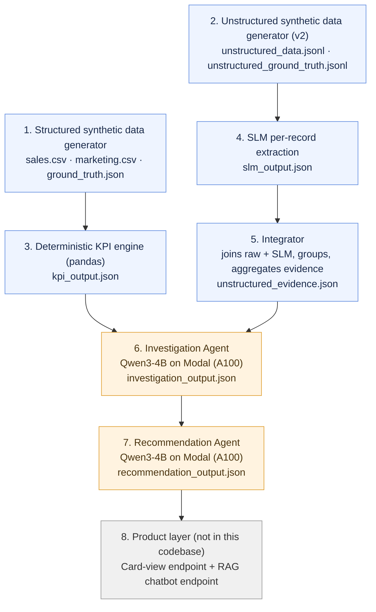

# InSightAI

**InSightAI** is a KPI-monitoring and root-cause-investigation prototype. It watches structured business metrics (sales, marketing spend), detects statistically *and* commercially material movements, cross-references those movements against unstructured business signals (support tickets, reviews, social mentions, internal chatter, news), generates ranked causal hypotheses using an LLM, and turns those hypotheses into concrete, evidence-grounded action recommendations — all surfaced to a manager through a card-based dashboard and a RAG chatbot.

---

## 1. Pipeline at a Glance

*(The Recommendation Agent also re-reads `kpi_output.json` and `unstructured_evidence.json` directly for its own context window — omitted from the arrows above to keep the flow readable; see §2.7 for the full detail.)*

---

## 2. Stage-by-Stage Breakdown

### 2.1 Structured synthetic data generator
Generates 90 days (Jan 1 – Mar 31, 2026) of daily `sales.csv` (region × product category grain) and weekly `marketing.csv` (region × channel grain) for 5 Indian regions and 4 product categories.

Crucially, it **injects 8 ground-truth causal events** (`GT001`–`GT008`) directly into the unit/price/spend series, each engineered to stress-test a different failure mode the pipeline needs to handle correctly:

| ID | Cause | What it tests |
|----|-------|----------------|
| GT001 | Warehouse dispatch backlog → shipment delay | Marketing stays flat — system shouldn't blame marketing |
| GT002 | Real digital ad-spend surge | Marketing genuinely *should* be identified as the driver |
| GT003 | Small, mixed, weak signals | Deliberately ambiguous — tests low-confidence / abstention behavior |
| GT004 | New product launch, sparse history | Tests handling of insufficient trailing data |
| GT005 | Price hike | Tests attribution to a pricing lever instead of defaulting to ops/marketing |
| GT006 | Supplier stockout | Tests distinguishing "unavailable" from "delayed" (vs. GT001) from ticket text alone |
| GT007 | Competitor promo | Tests attribution to an external/competitive cause |
| GT008 | Organic viral demand (no paid marketing) | Tests that the system doesn't wrongly credit marketing just because a spike coincides with unrelated ad activity |

`ground_truth.json` is written for **evaluation only** — it is never fed into the KPI, integration, investigation, or recommendation stages. It exists purely so we can score the pipeline's inferred causes against the true injected causes.

### 2.2 Unstructured synthetic data generator (v2)
It imports the same `INJECTED_EVENTS` ground truth from stage 2.1 and produces realistic unstructured evidence:

- Multiple source types per theme (`ticket`, `review`, `social`, `slack`/internal, `news`), each with a **different, theme-specific probability distribution** (e.g. shipment delays skew toward support tickets + internal Slack chatter; viral demand skews toward social + news).
- Templates that **deliberately never mention the canonical signal label** — the downstream extraction step has to infer the theme from context, not keyword-match it.
- ~300 unrelated **background noise** records mixed in, so the pipeline has to separate signal from noise realistically.
- A parallel `unstructured_ground_truth.jsonl` (again, eval-only, never fed downstream) labeling each record's true `signal_theme` for scoring extraction accuracy.

Outputs: `data/raw/unstructured_data.jsonl` (the actual pipeline input) and `data/raw/unstructured_ground_truth.jsonl` (eval-only).

### 2.3 SLM extraction (per-record)
A small language model reads each record in `unstructured_data.jsonl` independently and extracts a structured `slm_extraction` object per `source_id`: `signal_theme`, `signal`, `severity`, `evidence`, and `tags`. This is written to `data/slm_output.json` in the shape `{"results": [...]}` (or a plain list), which `integrator.py` consumes.
- Model & inference: fine-tuned unsloth/gemma-2-2b-it-bnb-4bit, loaded via Unsloth's FastModel. Runs batched inference (batch size 4) — multiple independent record-prompts processed simultaneously on GPU, left-padded so generated tokens start at the same offset for every item in the batch, greedy decoding (do_sample=False).

- Strictly scoped job — explicitly not a trend/aggregation/investigation system. Per record it only: (1) detects whether a meaningful signal exists, (2) classifies the signal theme, (3) extracts supporting evidence, (4) estimates severity. It is explicitly forbidden from inferring trends, frequency, recurrence, market-wide behavior, business impact, or causality — those are reserved for later stages (integrator / investigation agent).

- 7 canonical themes given as guidance (shipment_delay, marketing_spend_increase, price_increase, stockout, competitor_promo, organic_viral_demand, quality), but the model isn't hard-locked to them — it can emit a more specific free-text theme (e.g. packaging_quality) when that's a better semantic fit, and is told not to classify on keyword match alone (e.g. "arrived quickly" ≠ shipment_delay).

### 2.4 Integrator (`integrator.py`)
Pure Python [no-LLM] joining and aggregation layer. It:
- Joins each raw unstructured record to its SLM extraction on `source_id`.
- Drops records where the SLM found no signal theme.
- Groups the remainder by `(signal_theme, region, product_category)`.
- For each group, computes observation counts, source/channel/severity distributions, tag counts, a daily observation trend (`increasing` / `decreasing` / `stable` / `insufficient_data`, based on comparing the first vs. second half of the observed window), and up to 10 representative evidence examples.
- **Deliberately does not infer causality** — it only aggregates "is this qualitative signal becoming more or less frequent," leaving causal reasoning entirely to the Investigation Agent.

Output: `data/unstructured_evidence.json`.

### 2.5 Deterministic KPI engine (`kpi/calculate_kpis.py`)
Pandas/NumPy only — **no LLM involved**, by design, so the "is something actually wrong" decision is auditable and reproducible.

- For every `(region, product_category)` pair, computes a 14-day trailing rolling mean/std of `units_sold` (using `shift(1)` so a day never contaminates its own baseline) and a rolling z-score.
- Computes revenue's % deviation from its own trailing baseline, and week-over-week % change for both units and revenue.
- **Materiality rule:** a day is flagged `material_movement` only if it is *both* statistically unusual (`|z| > 2.5`) *and* commercially material (`|revenue deviation| ≥ 15%`) — statistical significance alone is not enough. Rows with fewer than 5 trailing days of history are flagged `insufficient_history` rather than silently skipped or falsely flagged (this is what GT004 is designed to trigger).
- Collapses consecutive flagged days into contiguous **movement windows** (allowing up to a 4-day gap within one window) — this is the unit of work handed to the Investigation Agent, rather than one row per day.
- Rolls marketing spend/impressions up to weekly region-level totals with week-over-week spend change, for cross-checking against flagged sales movements.

Output: `data/kpi_output.json`, containing `flagged_movements` (the movement windows), the full `kpi_table`, and `marketing_weekly`.

### 2.6 Investigation Agent (`investigation/investigate.py`)
Runs on **Modal** using an **A100 GPU**, since local inference of `Qwen/Qwen3-4B` (loaded in 8-bit via `bitsandbytes`) wasn't practical to prototype otherwise.

For each flagged movement, it builds a **focused context window** (14 days before → 7 days after the movement) pulling only the relevant `kpi_table` rows, `marketing_weekly` rows, and `unstructured_evidence` groups whose region/category/date-range overlap the movement. This keeps the prompt small and on-topic instead of dumping the entire dataset into the model.

The model is prompted (thinking mode disabled, greedy decoding) to return **3–5 ranked hypotheses**, each with supporting evidence, contradicting evidence, missing evidence, a confidence score, and a recommended next diagnostic check. The prompt explicitly forbids treating correlation as proof and requires the model to say when evidence is insufficient rather than fabricate a story. Output is strict JSON, parsed and schema-validated (rank/confidence bounds, required fields); malformed output is preserved with a `parse_error` field rather than dropped, so failures are visible.

Output: `data/investigation_output.json` (currently runs the top 5 movements per pipeline run).

### 2.7 Recommendation Agent (`recommendation/recommend.py`)
Also runs on **Modal + A100**, same `Qwen3-4B` model (loaded here in 4-bit NF4 for a lighter footprint), because it needs the same GPU-backed inference as the Investigation Agent.

This agent does **not** re-derive causes. It takes the Investigation Agent's ranked hypotheses, the KPI context, and a **deterministically retrieved** subset of unstructured evidence (region/category hard-filtered, then scored by lexical overlap between the evidence group's `signal_theme` and the investigation's hypothesis text, date overlap, observation volume, and severity — top 8 groups survive, capping prompt size), plus a fixed **50-action catalog** spanning Operations, Supply Chain, Marketing, Pricing, Competitive Intelligence, Customer Experience, Product, Analytics, and Strategy/Management.

It is constrained to select **exactly 5** actions, all of which must come from the catalog (no invented actions/capabilities/budgets), each with a rationale, supporting evidence, a feasibility judgment (`high`/`medium`/`low`/`unknown` — `unknown` is required when feasibility genuinely can't be established from the evidence), expected effect, a risk/limitation, and a concrete next step. Output is strictly validated: exactly 5 recommendations, valid catalog IDs, no duplicates, ranks `[1..5]`, confidence in `[0,1]`.

Output: `data/recommendation_output.json`.

### 2.8 Product layer (not included in this repository)
A separate web application (source not part of this drop, but referenced/linked in the repo) consumes the JSON artifacts above through two endpoints:

1. **Card-view endpoint** — takes the pipeline output and renders it as a set of static image "cards" (one per detected movement), which a manager can drag/rearrange to review KPIs, the investigation hypotheses, and the recommendations for each movement side by side.
2. **Chatbot endpoint** — ingests all pipeline outputs (KPI table, evidence groups, investigations, recommendations) into a vector DB and answers a manager's ad-hoc questions over that data via RAG.

---

## 3. Why the LLM steps are isolated behind Modal

Both `investigate.py` and `recommend.py` need `Qwen/Qwen3-4B` inference at a scale (~2K token generations per movement, across several movements per run) that wasn't practical on prototyping hardware. Both are wrapped as **Modal Functions** requesting an `A100` GPU, reading/writing through a shared Modal `Volume` (`insightai-data`), so the actual heavy inference happens on-demand in the cloud while everything else (data generation, KPI math, integration) runs as plain local scripts.

---

## 4. A Note on few of the Design choices

- **Deterministic KPI detection, LLM-free.** Whether a movement is "material" is decided entirely by pandas/z-scores/thresholds — this keeps the trigger for an investigation auditable and reproducible, and means the LLM is only ever asked to explain *why*, never to decide *whether*.
- **Ground truth is eval-only, never pipeline input.** Both `ground_truth.json` and `unstructured_ground_truth.jsonl` are excluded from every stage after generation; they exist solely to score the system's inferred causes against injected reality.
- **Evidence retrieval is deterministic, not the LLM's job.** Both the Investigation and Recommendation agents receive a pre-filtered, pre-scored slice of evidence (by region/category/date-overlap/relevance) rather than the full store, keeping prompts small and keeping "what evidence is relevant" auditable outside the model.
- **Explicit abstention paths.** Sparse-history movements are flagged (not silently skipped or falsely flagged as material), and both agents are instructed — and validated — to use `unknown`/low-confidence outputs rather than fabricate certainty when evidence is thin (this is what the GT003/GT004 test cases are designed to exercise).
- **Strict, validated JSON contracts** between every stage (schema checks on hypothesis/recommendation fields, confidence bounds, exact recommendation count, catalog membership) so a malformed LLM response fails loudly instead of silently corrupting downstream stages.

